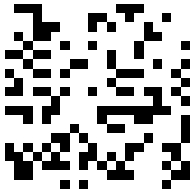
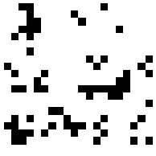
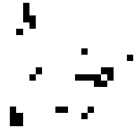

# Conway's game of life

This is an implementation of Conway's game of life (GOL). It is defined by a simple set of rules, which apply to each node on a grid. The rules are the following:

1. If a live cell has less than two neighbors, it dies.
2. If a live cell has two or three neighbors, it lives to the next generation.
3. If a live cell has more than three neighbors, it dies.
4. If a dead cell has exactly three live neighbors, it lives.

This simple set of rules results in complex, emergent behavior.

## Features

- Apply the rules of GOL to an arbitrarily sized grid using the `game_of_life.Game` class.
- Use PNG images as input for your system.
- The `game_of_life.Game` class also contains several analytics tools and plotting capabilities.
- Easy to use, several use cases are demonstratet in `game_of_life.demo`.

## Example usage

An example can be found in `game_of_life.__main__`, which can be executed via

```bash
python -m game_of_life
```

in the command line. It initializes the following (randomized) grid:



The first timestep yields:



The second timestep yields:


